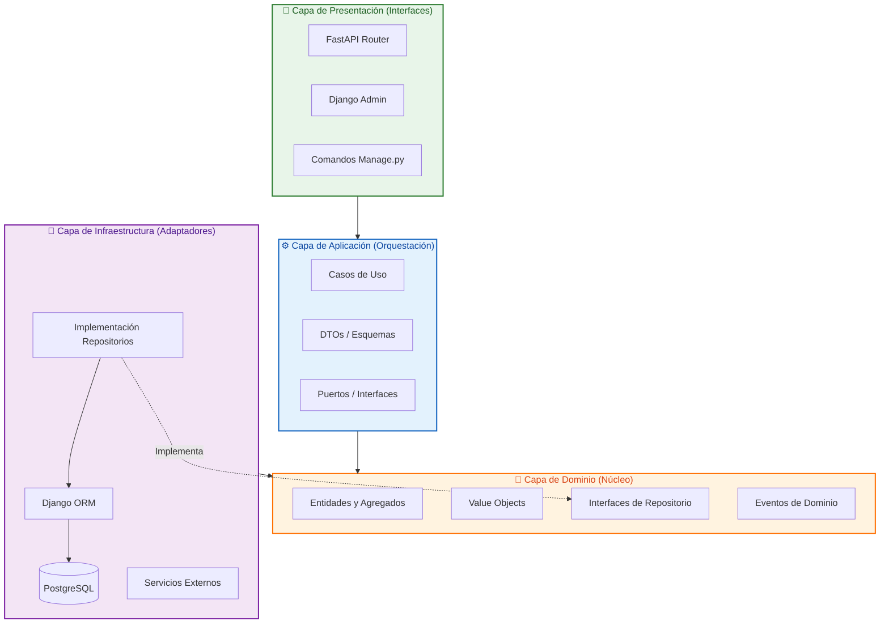
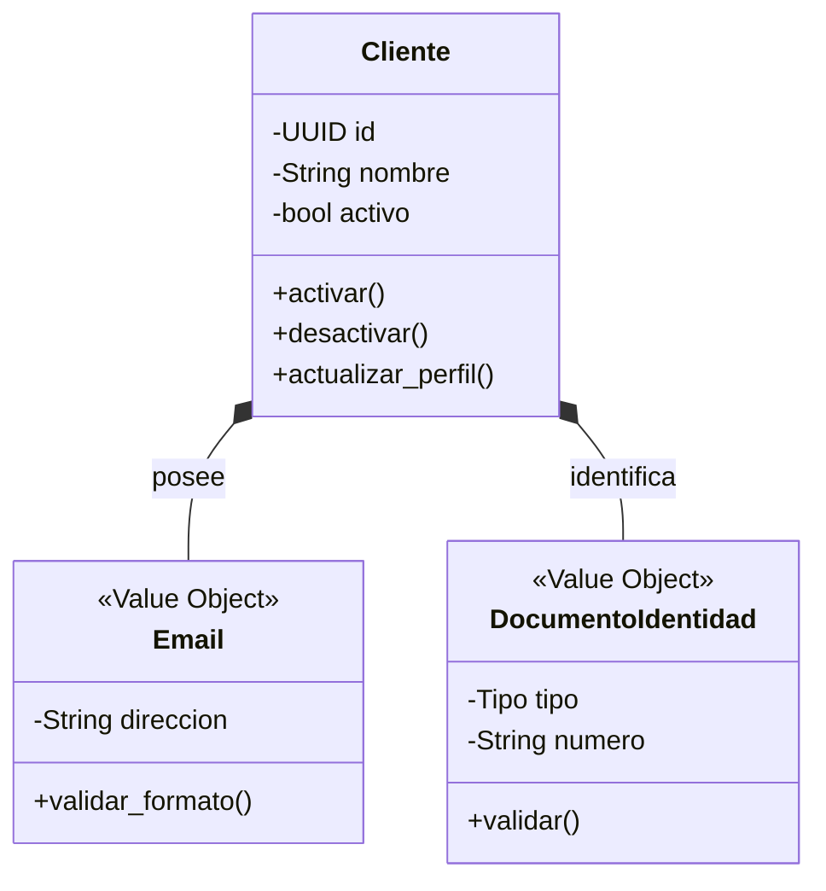
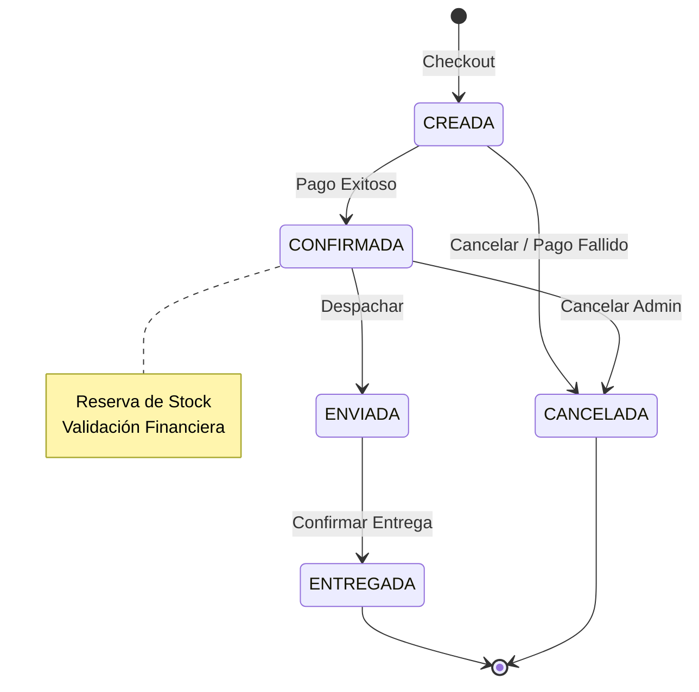
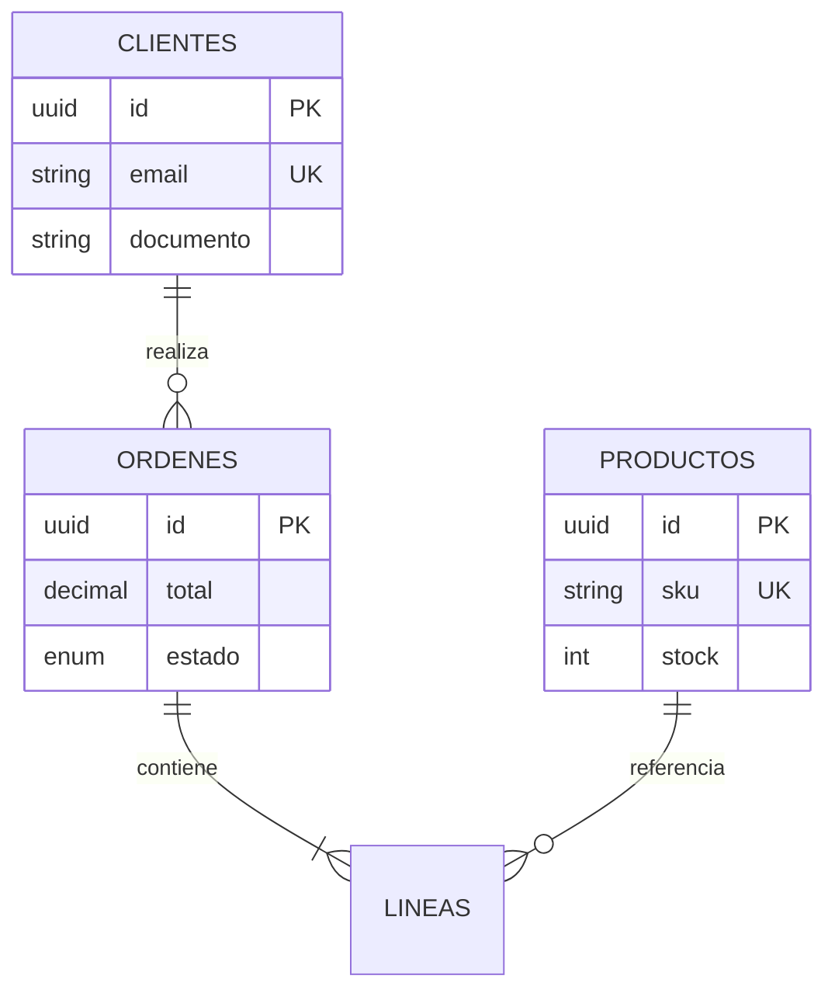

<div align="center">

# 🏢 Sistema Empresarial de Gestión - Clean Architecture

### Arquitectura Empresarial escalable con DDD, CQRS y Event-Driven Design

[](https://www.python.org/)
[](https://www.djangoproject.com/)
[](https://www.postgresql.org/)
[](https://fastapi.tiangolo.com/)
[](https://blog.cleancoder.com/uncle-bob/2012/08/13/the-clean-architecture.html)

</div>

---

## 📋 Visión General

Este sistema es una implementación de **referencia industrial** de principios de ingeniería de software moderna. Diseñado para desacoplar completamente la lógica de negocio de la infraestructura tecnológica, permite que el sistema evolucione sin deuda técnica.

El núcleo de la aplicación implementa **Domain-Driven Design (DDD)** para modelar procesos de negocio complejos, mientras que la separación por **Capas (Clean Architecture)** asegura que bases de datos, APIs y frameworks sean meros detalles de implementación.

---

## 🏗️ Arquitectura del Sistema

La arquitectura está diseñada concéntricamente. Las dependencias fluyen **únicamente hacia adentro**, protegiendo el Dominio (reglas de negocio) de cambios externos.

### Diagrama de Componentes y Capas


```mermaid
graph TD
    subgraph Presentation ["📱 Capa de Presentación (Interfaces)"]
        API[FastAPI Router]
        Admin[Django Admin]
        CLI[Comandos Manage.py]
    end

    subgraph Application ["⚙️ Capa de Aplicación (Orquestación)"]
        UseCases[Casos de Uso]
        DTOs[DTOs / Esquemas]
        Ports[Puertos / Interfaces]
    end

    subgraph Domain ["💎 Capa de Dominio (Núcleo)"]
        Entities[Entidades y Agregados]
        VO[Value Objects]
        RepoInt[Interfaces de Repositorio]
        Events[Eventos de Dominio]
    end

    subgraph Infrastructure ["🔌 Capa de Infraestructura (Adaptadores)"]
        RepoImpl[Implementación Repositorios]
        ORM[Django ORM]
        Postgres[(PostgreSQL)]
        EmailSvc[Servicios Externos]
    end

    Presentation --> Application
    Application --> Domain
    Infrastructure --> Domain
    
    RepoImpl -. Implementa .-> RepoInt
    RepoImpl --> ORM
    ORM --> Postgres
    
    style Domain fill:#fff3e0,stroke:#ff6f00,stroke-width:2px,color:#d84315
    style Application fill:#e3f2fd,stroke:#1565c0,stroke-width:2px,color:#0d47a1
    style Infrastructure fill:#f3e5f5,stroke:#7b1fa2,stroke-width:2px,color:#4a148c
    style Presentation fill:#e8f5e9,stroke:#2e7d32,stroke-width:2px,color:#1b5e20
```

---

## 🔄 Flujos de Datos (CQRS)

El sistema separa las operaciones de lectura y escritura para optimizar rendimiento y seguridad.

```mermaid
sequenceDiagram
    autonumber
    padding 20
    participant Client as Cliente (API/Web)
    participant API as FastAPI Router
    participant UC as Caso de Uso
    participant Dom as Entidad de Dominio
    participant Repo as Repositorio
    participant DB as PostgreSQL

    rect rgb(240, 248, 255)
        Note over Client, DB: Flujo de Comando (Escritura)
        Client->>API: POST /clientes (Crear)
        API->>UC: Ejecutar(DTO)
        UC->>Dom: Crear Entidad + Validar Invariantes
        Dom-->>UC: Entidad Válida
        UC->>Repo: Guardar(Entidad)
        Repo->>DB: INSERT / UPDATE
        DB-->>Repo: Confirmación
        Repo-->>UC: Entidad Persistida
        UC-->>API: Resultado DTO
        API-->>Client: 201 Created
    end
```

---

## 🧠 Modelado de Dominio (DDD)

### Diagrama de Clases (Agregado Cliente)
El diseño utiliza **Value Objects** para encapsular reglas de validación (email válido, formato de teléfono) y **Agregados** para garantizar la consistencia transaccional.


```mermaid
classDiagram
    direction TB
    class Cliente {
        -UUID id
        -String nombre
        -bool activo
        +activar()
        +desactivar()
        +actualizar_perfil()
    }

    class Email {
        <<Value Object>>
        -String direccion
        +validar_formato()
    }

    class DocumentoIdentidad {
        <<Value Object>>
        -Tipo tipo
        -String numero
        +validar()
    }

    Cliente *-- Email : posee
    Cliente *-- DocumentoIdentidad : identifica
```

### Ciclo de Vida de Órdenes (Máquina de Estados)
Las transiciones de estado de una orden están estrictamente controladas por el dominio.


```mermaid
stateDiagram-v2
    [*] --> CREADA : Checkout
    
    CREADA --> CONFIRMADA : Pago Exitoso
    CREADA --> CANCELADA : Cancelar / Pago Fallido
    
    CONFIRMADA --> ENVIADA : Despachar
    CONFIRMADA --> CANCELADA : Cancelar Admin
    
    ENVIADA --> ENTREGADA : Confirmar Entrega
    
    ENTREGADA --> [*]
    CANCELADA --> [*]

    note right of CONFIRMADA
        Reserva de Stock
        Validación Financiera
    end note
```

---

## 💾 Persistencia de Datos

Esquema físico optimizado en PostgreSQL, gestionado vía migraciones de Django pero desacoplado del dominio.


```mermaid
erDiagram
    CLIENTES ||--o{ ORDENES : realiza
    ORDENES ||--|{ LINEAS : contiene
    PRODUCTOS ||--o{ LINEAS : referencia

    CLIENTES {
        uuid id PK
        string email UK
        string documento
    }
    ORDENES {
        uuid id PK
        decimal total
        enum estado
    }
    PRODUCTOS {
        uuid id PK
        string sku UK
        int stock
    }
```

---

## 🛠️ Stack Tecnológico

| Capa | Tecnología | Rol Principal |
|---|---|---|
| **Dominio** | Python Puro | Reglas de negocio, Entidades, VO |
| **Aplicación** | Python Libs | Casos de uso, DTOs, Validaciones |
| **Infraestructura** | **Django 6.0** | ORM, Admin Panel, Auth, Migraciones |
| **Interface API** | **FastAPI** | Endpoints Async de alto rendimiento, Swagger UI |
| **Base de Datos** | **PostgreSQL 18** | Persistencia relacional robusta |
| **Testing** | PyTest | Pruebas unitarias y de integración |

---

## 🚀 Instalación y Ejecución

### 1. Preparar Entorno
```bash
git clone <repo-url>
cd e-comerce
python -m venv venv
# Activar: venv\Scripts\activate (Windows) o source venv/bin/activate (Linux)
```

### 2. Dependencias
```bash
pip install -r requirements.txt
```

### 3. Configuración
Crea un archivo `.env` basado en `.env.example` con tus credenciales de PostgreSQL.

### 4. Ejecución
```bash
# Migrar base de datos
python manage.py migrate

# Iniciar servidor (Híbrido Django + FastAPI)
python manage.py runserver
```

---
<div align="center">
    <sub>Diseñado con altos estándares de calidad de software.</sub>
</div>
